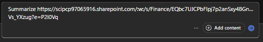

## Task 04: Verify exclusion policies via test Copilot sessions

1. [] In the browser tab, go to the **Contoso OneDrive**(appears as `Home – OneDrive`).

1. [] Select **Create or Upload**, then **Word document**. 

1. [] Select the **Generate** icon in the Copilot tip window. 

    {: .note }
    > At the top of the document, to the right of the title, hover over the shield with the question mark to show there is no label applied to the document. 

    
   
1. [] Select Enter to proceed. 

    {: .note }
    > Notice the banner saying the label was automatically applied. You can hover over the red shield in the black Copilot bar near the bottom of the screen. This is the label of the source document. Hover over the red shield to the right of the document title. This is the current document’s label – they match. 
   
1. [] Go to the [Microsoft Copilot](https://m365.cloud.microsoft/chat) tab.

1. [] In the message Copilot box, enter: 

    ```prompt
    Summarize https://scipcp97065916.sharepoint.com/:w:/s/Finance/EQbc7UJCPbFIpj7p2anSxy4BGnD6i_FO0v2WD-Vs_YXzug?e=Pbn45b
    ```
    
1. [] Select the **Send** arrow. 

1. [] Select Enter to proceed. 

   {: .note }
    > Notice the message: The file you shared, *Proseware Merger Status Report*, is restricted by your organization's security policies, so I can't access its contents directly. Hover over the red shield to the right of the Copilot text. 
